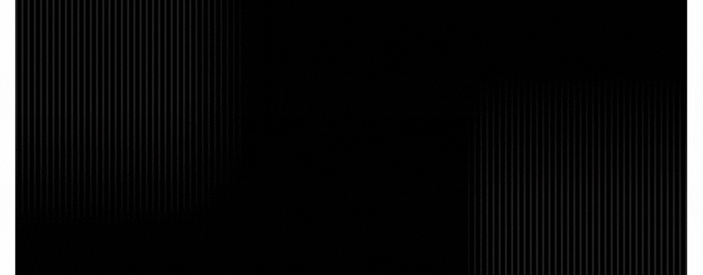

  

<!-- Social icons section -->
<h1 align="center"> Social Media: </h1>

  
  
  
  

<!-- Description about me -->
<h2 align="center"> 🤔 About me 👨‍💻 </h2>

<table style="border-collapse: collapse; border: none; width: 100%;">
  <tr style="border: none;">
    <td style="border: none; padding: 0; vertical-align: top;">
      <ul style="list-style-type: none; padding-left: 0;">
        <li>🔭 I graduated in Information Systems from <b>BFCAI</b></li>
        <li>🤝 I’m looking to collaborate on Open Source Projects</li>
        <li>🌱 Building seamless mobile journeys with <b><u>Flutter</u></b>, powered by <b><u>Node.js</u></b> backends </li>
        <li>👨🏻‍💻 Most of my projects are available on <a href="https://github.com/abdelstarMo66?tab=repositories">Github</a></li>
        <li>💬 Ask me about anything tech related, I am happy to help</li>
        <li>📫 Feel free to contact me on <a href="https://www.linkedin.com/in/abdelsatar5060">LinkedIn</a></li>
        <li>🏋️ When I am free, I like to go to the gym</li>
        <li>📝 Checkout my <a href="">Page</a></li>
      </ul>
    </td>
    <td style="border: none; padding: 0; text-align: right;">
      
    </td>
  </tr>
</table>

<!-- Description about me -->
<h2 align="center"> 🤔 Programming Languages and Frameworks 👨‍💻 </h2>

  

  

